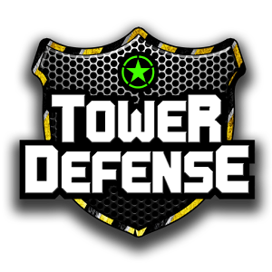
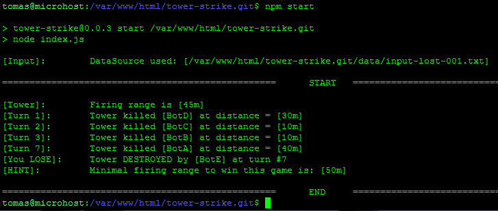
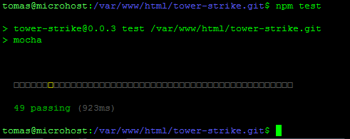
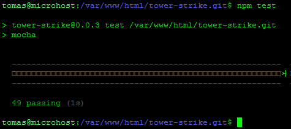
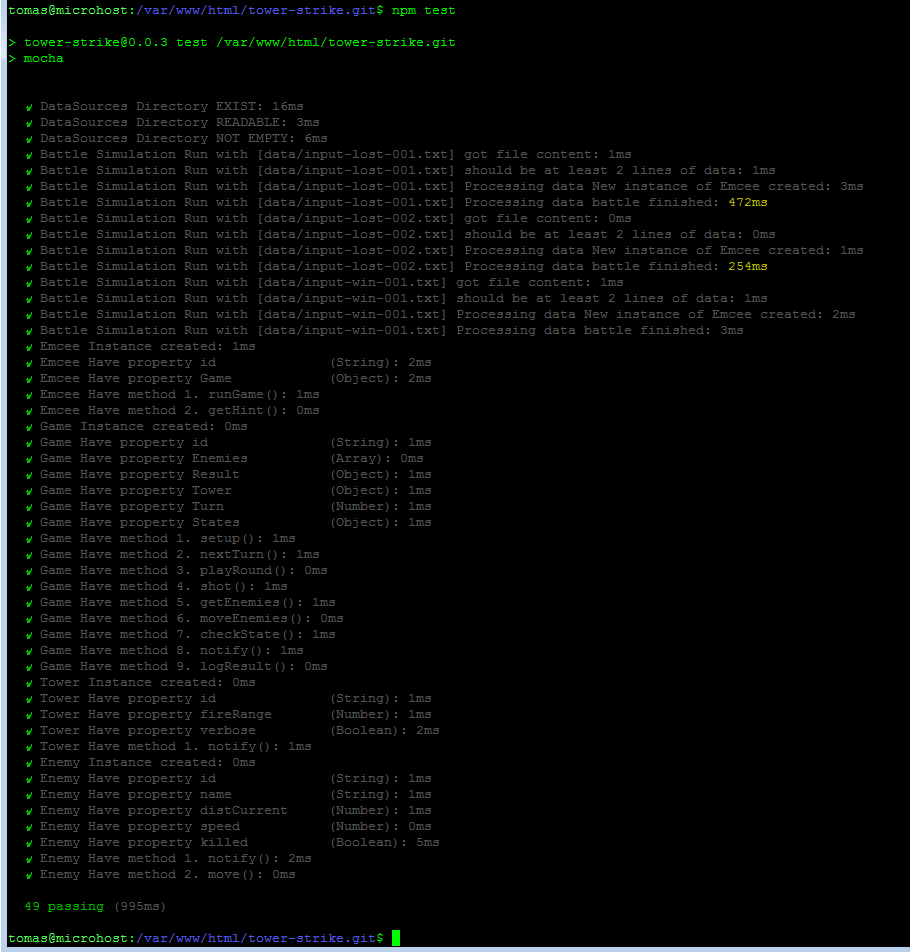

Simulate a game where the goal is to kill the enemies by using a tower.

---

## Task definition ##

### Problem Statement ###
Program should simulate a game where the goal is to kill the enemies by using a tower.
Need to kill enemies as fast as possible.
At each turn first the tower fires one time then each enemy moves to the tower.
If an enemy reaches the tower you lose.

### Input ###
The first line is the tower's firing range.
Each next line represents an enemy:
1. first column - is the enemy name.
2. second column - is the initial distance to the tower.
3. the last one - is the unit speed.

### Output ###
 - At each turn program should inform if the tower killed the enemy unit.
 - At the end program should inform if the tower WINS or LOSES and the count of played turns.
 - In case of lost the program should calculate the minimal tower's firing distance to win the game against same set of enemies.

### Samples ###

#### Sample Input ####
```javascript
50m
BotA 100m 10m
BotB 50m 20m
BotC 30m 20m
```

#### Sample Output ####
```javascript
Firing range is 50m
Turn 1: Kill BotC at 30m
Turn 2: Kill BotB at 30m
Turn 6: Kill BotA at 50m
Tower WIN in 6 turn(s)
```

## Tasks checklist ##

 - [x] Create programmatic simulator for this game that has to be executed on **node.js@0.12.14**
 - [x] Feel free to write unit tests
 - [x] NPM available libs are: [lodash](https://lodash.com/), [winston](https://www.npmjs.com/package/winston), [chance](http://chancejs.com/), [should](http://shouldjs.github.io/), [mocha](http://mochajs.org/)

---

## Prerequisites ##

#### Install NVM ####

To install or update nvm, you can use the install script using cURL:

```shell
$ curl -o- https://raw.githubusercontent.com/creationix/nvm/v0.33.2/install.sh | bash
```
or Wget:
```shell
$ wget -qO- https://raw.githubusercontent.com/creationix/nvm/v0.33.2/install.sh | bash
```

#### Install node.js v0.12.14 ####

```shell
$ nvm install 0.12.14
```

---

## Setup ##

#### Get sources ####

```shell
$ git clone https://github.com/tbaltrushaitis/tower-strike.git
```

#### Install dependencies and build ####

```shell
$ cd tower-strike
$ npm i
```

---

## Usage ##

#### Standard execution ####

```shell
$ nvm exec 0.12.14 npm start
```



#### Development stage ####

```shell
$ nvm exec 0.12.14 gulp
$ nvm exec 0.12.14 npm run dev
```

#### Testing ####

```shell
$ make test
$ npm test
```

<div align="center">
  
</div>

#### List of available reporters ####

Reporter for tests could be changed in [mocha options file](test/mocha.opts) by changing the value of `--reporter` parameter.
Here is the list of possible values for the option:

<details>
  <summary>doc</summary>
  <a href="assets/npm-test-reporter-doc.html" target="blank">Example of HTML code generated</a>
</details>

<details>
  <summary>dot</summary>
  <div align="center">
    
  </div>
</details>

<details>
  <summary>landing</summary>
  <div align="center">
    
  </div>
</details>

<details>
  <summary>list</summary>
  <div align="center">
    
  </div>
</details>

<details>
  <summary>nyan</summary>
  <div align="center">
    
  </div>
</details>

<details>
  <summary>tap</summary>
  <div align="center">
    
  </div>
</details>

<details>
  <summary>json</summary>
  <a href="assets/npm-test-reporter-json.json" target="blank">JSON data</a>
</details>

<details>
  <summary>json-stream</summary>
  <a href="assets/npm-test-reporter-json-stream.txt" target="blank">JSON-stream data</a>
</details>

<details>
  <summary>markdown</summary>
  <a href="assets/npm-test-reporter-markdown.md" target="blank">Markdown file</a>
</details>

<details>
  <summary>base</summary>
</details>

<details>
  <summary>min</summary>
</details>

<details>
  <summary>progress</summary>
</details>

<details>
  <summary>html</summary>
</details>

<details>
  <summary>xunit</summary>
</details>

---

#### Useful Info ####

 - [GitHub / Basic writing and formatting syntax](https://help.github.com/articles/basic-writing-and-formatting-syntax/)
 - [BitBucket / Markdown Howto](https://bitbucket.org/tutorials/markdowndemo)
 - [Docker / Creating an Automated Build](https://docs.docker.com/docker-hub/builds/)
 - [Docker / Linking containers](https://docs.docker.com/engine/userguide/networking/default_network/dockerlinks.md)
 - [Docker / Cross-host linking containers](https://docs.docker.com/engine/admin/ambassador_pattern_linking.md)

---

> :calendar: Developed on **June 2017**

:scorpius:
